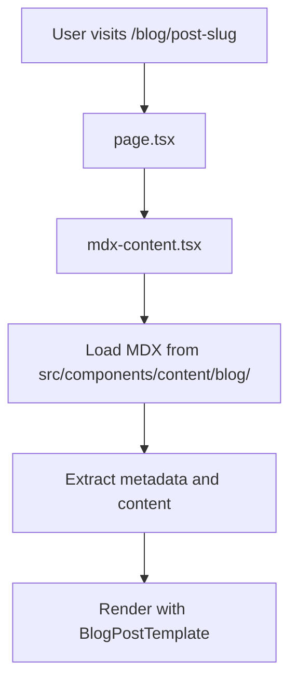

# Blog System Documentation

## Overview

The Tracer marketing website uses an **MDX-based blog system** (Markdown + JSX) for all blog posts. The system is built on Next.js 15 with dynamic routing and features a centralized registry for managing all blog content. MDX allows you to write content in Markdown while embedding React components for interactive and rich content.

## System Architecture

### 1. Routing System

The blog system uses Next.js dynamic routing with the following structure:

```
/blog/[slug] → src/app/blog/[slug]/page.tsx
```

**Key Components:**
- `page.tsx` - Main route handler that loads MDX content
- `mdx-content.tsx` - Renders MDX blog posts with templates

### 2. Content Flow



### 3. File Structure

```
src/
├── app/blog/
│   ├── page.tsx                      # Blog listing page
│   ├── BlogPageClient.tsx            # Client-side blog grid
│   └── [slug]/
│       ├── page.tsx                  # Dynamic route handler
│       └── mdx-content.tsx           # MDX post renderer
├── components/
│   ├── blog/
│   │   ├── BlogPostTemplate.tsx      # Template system (4 templates)
│   │   ├── BlogCard.tsx              # Blog preview cards
│   │   └── BlogGrid.tsx              # Blog listing grid
│   └── content/blog/
│       ├── post-slug.mdx             # MDX blog posts
│       └── _meta.json                # MDX metadata
├── lib/
│   └── blog-registry.ts              # Centralized blog management
└── public/Blog/                      # Blog images
```

## MDX Blog Posts

**Location:** `src/components/content/blog/[slug].mdx`

**Features:**
- Markdown + JSX support
- React component embedding
- Template system integration
- Metadata export
- Syntax highlighting
- Interactive components

**Example Structure:**
```mdx
export const metadata = {
  title: 'Your Blog Post Title',
  date: 'January 21, 2024',
  description: 'Post description for SEO and previews',
  author: 'Team Tracer',
  tag: 'product',
  readTime: '5 min read',
  ogImage: '/Blog/your-image.webp',
  template: 'default' // or 'minimal', 'magazine', 'technical'
};

# Your Blog Post Title

Your content goes here...

## Subheading

You can use **markdown** and even React components:

<div className="bg-gray-100 p-4 rounded">
  Custom JSX content
</div>

```javascript
// Code blocks with syntax highlighting
function example() {
  console.log('Hello, world!');
}
```
```

## Template System

The blog system includes 4 built-in templates:

### 1. Default Template
- **Use case:** Standard blog posts
- **Style:** Dark theme (#202020), hero image, centered layout
- **Max width:** 928px
- **Features:** Full metadata display, hero image, clean typography

### 2. Minimal Template  
- **Use case:** Typography-focused content
- **Style:** Light theme, clean design
- **Max width:** 768px (3xl)
- **Features:** Large title, minimal metadata, prose styling

### 3. Magazine Template
- **Use case:** Editorial content
- **Style:** Two-column layout with sidebar
- **Max width:** 1152px (6xl)
- **Features:** Sticky sidebar with metadata, main content area

### 4. Technical Template
- **Use case:** Code-heavy, technical posts
- **Style:** Monospace fonts, code-friendly
- **Max width:** 1024px (5xl)
- **Features:** Monospace typography, enhanced code styling

## Centralized Registry System

The `blog-registry.ts` file serves as the single source of truth for all blog posts:

**Key Functions:**
- `getAllBlogPosts()` - Returns all MDX posts with metadata
- `getBlogPost(slug)` - Gets specific post by slug
- `isMDXBlogPost(slug)` - Checks if post exists
- `getBlogPostsForStaticGeneration()` - For Next.js static generation
- `getAllMDXSlugs()` - Returns all available MDX post slugs

**MDX Post Registry:**
```typescript
const MDX_BLOG_POSTS = [
  'introducing-tracer-pt-1',
  'introducing-tracer-pt-2',
  'kenya-day-one',
  'kenya-day-two',
  // ... add your new posts here
] as const;
```

## Blog Listing & Discovery

### Main Blog Page (`/blog`)
- Displays filtered posts (currently Kenya hackathon series)
- Client-side filtering and sorting
- Responsive grid layout
- Smart routing for content availability

### Blog Cards
- Preview with image, title, description
- Smart routing based on content availability
- "Coming soon" state for unpublished posts
- Responsive design

## Image Management

**Location:** `public/Blog/`

**Naming Convention:**
- Use descriptive names: `day1-city-view.webp`
- Prefer WebP format for optimization
- Include preview images for social sharing

**Usage in Posts:**
```mdx
// In MDX metadata
ogImage: '/Blog/your-image.webp'

// In MDX content

```

---

# How to Add a Blog Post

### Step 1: Create the MDX File

Create a new file in `src/components/content/blog/your-post-slug.mdx`:

```mdx
export const metadata = {
  title: 'Your Amazing Blog Post',
  date: 'January 21, 2024',
  description: 'A compelling description that will appear in previews and SEO',
  author: 'Team Tracer',
  tag: 'product', // or 'development', 'blog', etc.
  readTime: '5 min read',
  ogImage: '/Blog/your-hero-image.webp',
  template: 'default' // Choose: default, minimal, magazine, technical
};

# Your Amazing Blog Post

Write your content here using Markdown syntax.

## Subheadings Work Great

You can include:
- **Bold text**
- *Italic text*
- [Links](https://example.com)
- Code blocks
- Images
- And even React components!

```javascript
// Code blocks are fully supported
function example() {
  console.log('Hello, world!');
}
```

<div className="bg-blue-50 p-4 rounded-lg my-6">
  <p className="text-blue-800 font-semibold">Pro Tip:</p>
  <p className="text-blue-700">You can embed React components directly in MDX!</p>
</div>

## Images


## Conclusion

Your concluding thoughts here.
```

### Step 2: Add Your Images

1. Add your hero image and any content images to `public/Blog/`
2. Use descriptive filenames: `your-post-hero.webp`, `diagram-example.webp`
3. Prefer WebP format for better performance

### Step 3: Register the Post

Add your post slug to the MDX registry in `src/lib/blog-registry.ts`:

```typescript
const MDX_BLOG_POSTS = [
  'introducing-tracer-pt-1',
  'introducing-tracer-pt-2',
  // ... existing posts
  'your-post-slug', // ← Add your slug here
] as const;
```

### Step 4: Add Metadata (Optional)

If you want to override the metadata or add additional fields, update the `MDX_METADATA` object in `blog-registry.ts`:

```typescript
const MDX_METADATA: Record<string, BlogPostMetadata> = {
  // ... existing metadata
  'your-post-slug': {
    slug: 'your-post-slug',
    title: 'Your Amazing Blog Post',
    date: 'January 21, 2024',
    description: 'A compelling description...',
    author: 'Team Tracer',
    tag: 'product',
    readTime: '5 min read',
    ogImage: '/Blog/your-hero-image.webp',
    template: 'default'
  },
};
```

### Step 5: Test Your Post

1. Start the development server: `npm run dev`
2. Navigate to `http://localhost:3000/blog/your-post-slug`
3. Verify the post renders correctly
4. Check the blog listing page: `http://localhost:3000/blog`

## Template Selection Guide

Choose the right template for your content:

### Default Template
- **Best for:** Standard blog posts, announcements, general content
- **Features:** Dark theme, prominent hero image, full metadata
- **Use when:** You want the standard Tracer blog look

### Minimal Template
- **Best for:** Text-heavy content, thought pieces, essays
- **Features:** Clean typography, light theme, minimal distractions
- **Use when:** Content is the primary focus

### Magazine Template
- **Best for:** Long-form articles, case studies, detailed guides
- **Features:** Two-column layout, sidebar metadata, editorial feel
- **Use when:** You have substantial content that benefits from structure

### Technical Template
- **Best for:** Code tutorials, technical documentation, developer content
- **Features:** Monospace fonts, enhanced code styling, technical aesthetic
- **Use when:** Your post contains significant code examples or technical details

## Best Practices

### Content Guidelines
1. **Title:** Keep under 60 characters for SEO
2. **Description:** 120-160 characters, compelling and descriptive
3. **Images:** Use WebP format, optimize for web
4. **Read Time:** Estimate 200-250 words per minute
5. **Tags:** Use consistent tags across posts

### SEO Optimization
1. Include relevant keywords in title and description
2. Use descriptive alt text for images
3. Structure content with proper headings (H1, H2, H3)
4. Include internal links where relevant

### Performance
1. Optimize images before uploading
2. Use WebP format when possible
3. Keep MDX files focused and not overly complex
4. Test on mobile devices

## Troubleshooting

### Common Issues

**Post not appearing on blog listing:**
- Check if slug is added to the registry
- Verify metadata is properly exported
- Ensure the file is in the correct directory

**Images not loading:**
- Verify image path starts with `/Blog/`
- Check file exists in `public/Blog/`
- Ensure proper file extension

**Template not working:**
- Verify template name is spelled correctly
- Check available templates: `default`, `minimal`, `magazine`, `technical`
- Ensure template is specified in metadata

**MDX compilation errors:**
- Check for proper metadata export syntax
- Verify JSX components are properly closed
- Ensure no syntax errors in embedded code

### Development Tips

1. **Use the browser dev tools** to inspect styling issues
2. **Check the console** for any JavaScript errors
3. **Test responsive design** on different screen sizes
4. **Verify metadata** appears correctly in page source for SEO

## Advanced Features

### Custom Components in MDX

You can create reusable components for your blog posts:

```mdx
// In your MDX file
<CalloutBox type="warning">
  This is important information that stands out!
</CalloutBox>
```

### Dynamic Content

MDX supports dynamic content and state:

```mdx
import { useState } from 'react';

export function InteractiveExample() {
  const [count, setCount] = useState(0);

  return (
    <div>
      <p>Count: {count}</p>
      <button onClick={() => setCount(count + 1)}>
        Increment
      </button>
    </div>
  );
}

<InteractiveExample />
```

### Code Syntax Highlighting

Code blocks automatically get syntax highlighting:

```typescript
interface BlogPost {
  slug: string;
  title: string;
  date: string;
  content: string;
}
```

## Deployment Considerations

### Static Generation
- MDX posts are statically generated at build time
- Add new slugs to the registry before deployment
- Images must be available in the public directory

### Performance
- The system automatically optimizes images
- MDX content is bundled efficiently
- Templates are shared across posts for optimal loading

---

This documentation covers the complete blog system. For questions or issues, refer to the existing blog posts as examples or consult the component source code.
